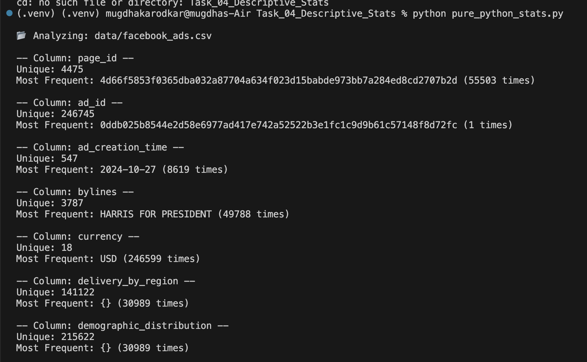
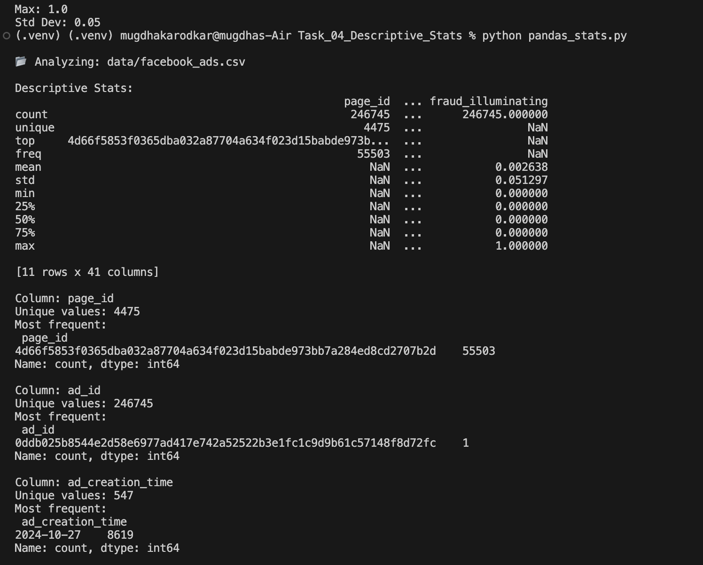
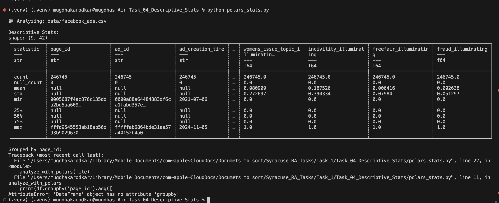
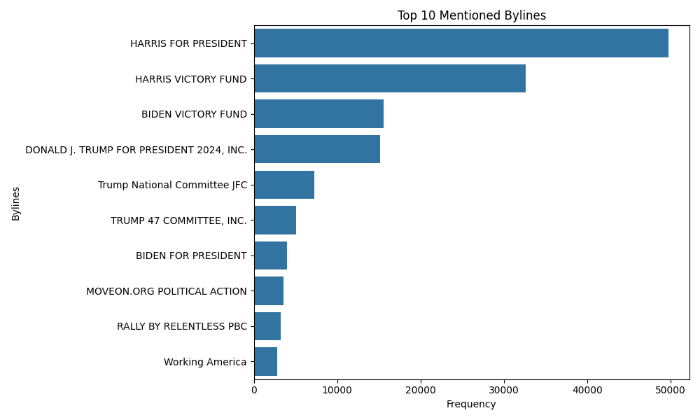
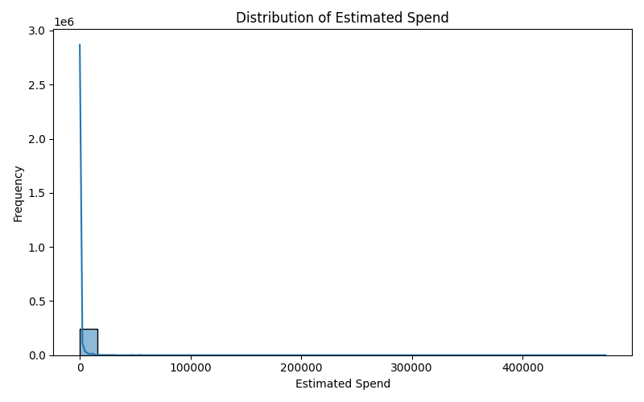
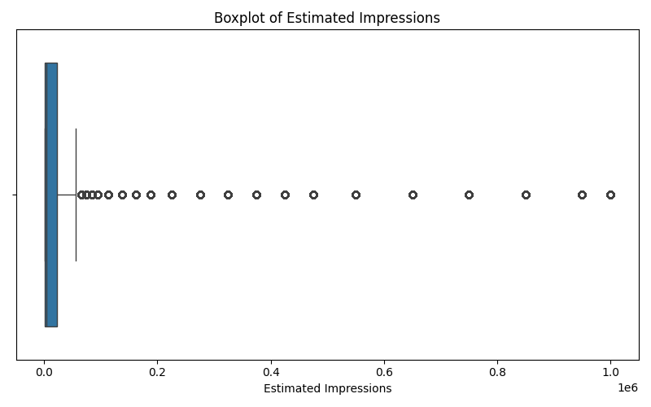

# 🗳️ Social Media Descriptive Statistics – 2024 US Presidential Candidates

This project is part of the **iSchool, Syracuse University** research initiative. The goal is to provide basic descriptive statistics and grouped summaries for social media activity by political candidates during the 2024 U.S. presidential election.

---

## 📁 Files and Folders

- `data/` – Folder for the 3 datasets (not included in GitHub):
  - `facebook_ads.csv`
  - `facebook_posts.csv`
  - `twitter_posts.csv`
- `pure_python_stats.py` – Script using built-in Python for stats.
- `pandas_stats.py` – Script using the Pandas library.
- `polars_stats.py` – Script using the Polars library.
- `visualizations.py` – Script for creating charts like bar plots, histograms, and boxplots.
- `.gitignore` – Prevents committing datasets and unnecessary files.
- `README.md` – This file.

---

## ⚙️ How to Run

### 1. Set up the environment
```bash
python3 -m venv .venv
source .venv/bin/activate
```

### 2. Install required packages
```bash
pip install pandas polars matplotlib seaborn
```

### 3. Run the scripts
```bash
python pure_python_stats.py
python pandas_stats.py
python polars_stats.py
python visualizations.py
```

---

## 🧠 What Each Script Does

| Script               | Description |
|----------------------|-------------|
| `pure_python_stats.py` | Uses only built-in Python to calculate averages, counts, and frequencies. Good for understanding raw logic. |
| `pandas_stats.py`      | Uses Pandas for `.describe()`, groupby stats, and value counts. Efficient and industry-standard. |
| `polars_stats.py`      | Uses Polars for fast data processing, especially with large files. |
| `visualizations.py`    | Generates charts using Matplotlib and Seaborn. Includes bar charts, histograms, and boxplots. |

---

## 🧪 Sample Output Screenshots

### Pure Python Script Output  


### Pandas Script Output  


### Polars Script Output  


---

## 🔍 Summary of Findings

While analyzing the **Facebook ads dataset**, I discovered some notable insights:

- 📅 **Most frequent ad creation date**: `2024-10-27`, with over **8600 ads**.
- 🧑‍💼 **Most mentioned candidate**: “**HARRIS FOR PRESIDENT**” appeared nearly **50,000 times**.
- 💵 **Currency**: Almost all ads were in **USD**.
- 🎯 **Audience size**: Common value was `1,000,001`, appearing in over **100,000 ads**.
- 📱 **Platform distribution**: About **214,000 ads** were run on both Facebook and Instagram.
- 📍 **Empty fields**: Fields like `delivery_by_region` and `demographic_distribution` often had `{}` (empty entries).
- 💬 **Mentions**: Over **73,000 ads** had `[]` for `illuminating_mentions`.

### Tool Comparison

- ✅ **Pure Python**: Helped understand core logic manually.
- ⚡ **Pandas**: Much faster and detailed. Great for summaries.
- 🚀 **Polars**: Extremely fast, but ran into `.groupby` issues (different from Pandas).

This hands-on experience helped me understand how different libraries perform and how to extract useful insights from structured ad data.

---

## 📊 Visualization Samples

Charts were generated using `visualizations.py` (Matplotlib + Seaborn).

### Top 10 Mentioned Bylines  


### Estimated Spend Distribution  


### Boxplot of Estimated Impressions  

